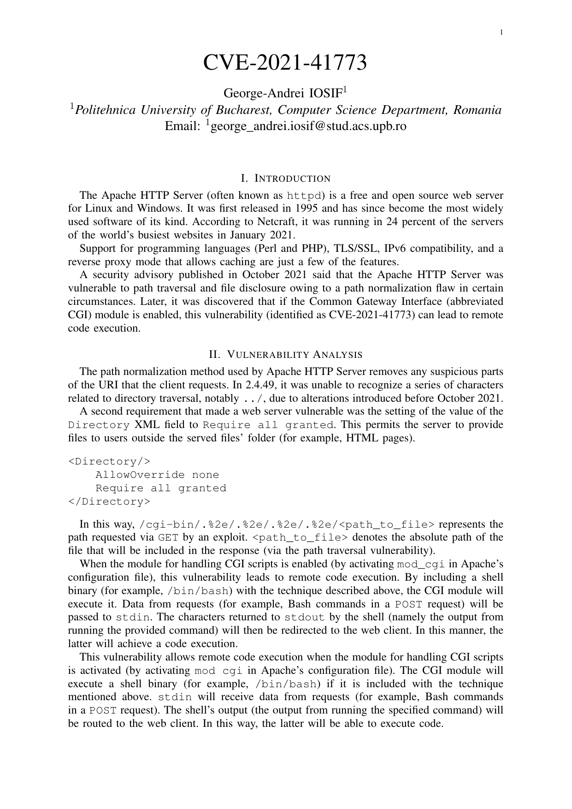
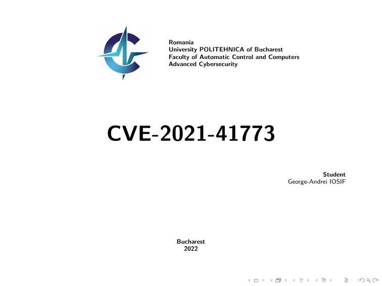

# ACSDocumentsTemplates ⬛

## Description 🖼️

**ACSDocumentsTemplates** is a template repository containing two LaTeX projects for both documents and presentations created in the Faculty of Automatic Control and Computers, University POLITEHNICA of Bucharest.

## Folders Structure 📁

The folder structure is as follows:
- **[`document`](document)**: The LaTeX project and the exported document.
- **[`presentation`](presentation)**: The LaTeX project and the exported presentation.

## Preview 👀

| Document                                                                                                           | Presentation                                                                                                                   |
| ------------------------------------------------------------------------------------------------------------------ | ------------------------------------------------------------------------------------------------------------------------------ |
| <a href="document/export.pdf"><kbd></kbd></a> | <a href="presentation/export.pdf"><kbd></kbd></a> |

## Contributors 🤝

- The OCTOCAT ([@octocat](https://github.com/octocat))
- GITHUB ([@github](https://github.com/github/))